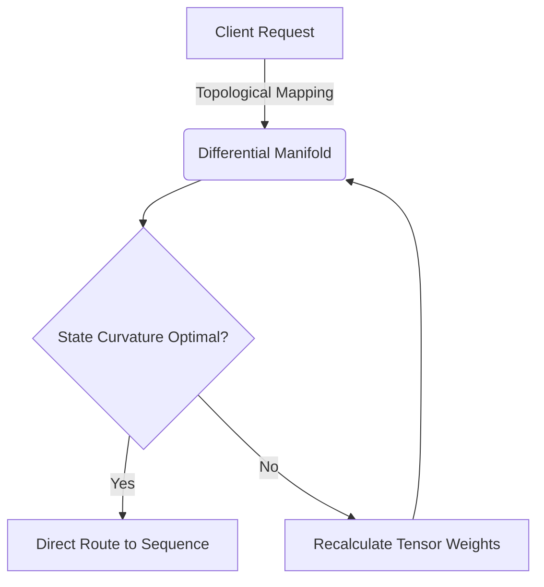
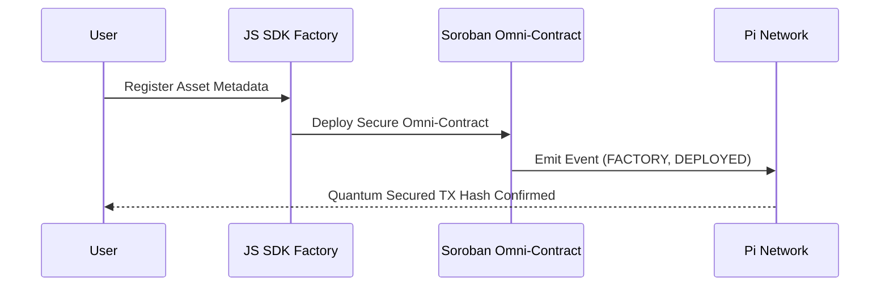
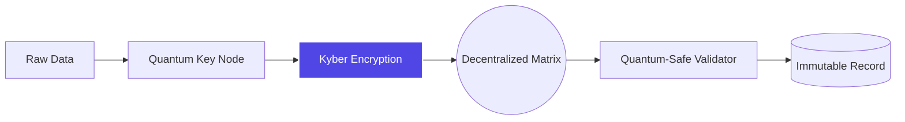

# 🌌 PiRC: Omni Sovereign Automation & Smart Contract Factory

Welcome to **PiRC Omni Sovereign Architecture**. This repository fuses **Differential Engineering** with **Post-Quantum Encryption** to provide an autonomous, secure, and liquid ecosystem for decentralized operations.

---

## 🚀 The "Raw Record Factory" & Ecosystem Impact

The **Sovereign Smart Contract Factory** revolutionizes the digitization of real-world assets:

- **Total Liquidity:** Transforms physical and digital goods into trackable, sovereign smart contracts.
- **Differential Routing:** Advanced mathematical manifolds dynamically optimize transaction topological states, killing network friction.
- **Quantum Security:** Encapsulates payloads with Kyber-compatible encryption, fortifying the ecosystem against future quantum brute-force decryption.

---

## 📂 Core Architecture & Updates Manifest

For our incredible development team, track and explore these core files:

- `Omni_Sovereign_Architecture/.../raw_record_factory.rs`: Global Soroban Rust Contract.
- `Omni_Sovereign_Architecture/.../raw_record_factory_sdk.js`: Quantum-tunneled Client SDK.
- `core/math/differential_geometry.py`: Manifold engine for curvature calculation.
- `core/crypto/quantum_sim.py`: Quantum key generation layer.

---

## 🛠️ Testing & Integration (Developer Guide)

1. **Smart Contracts:** Install Rust 2024 & Soroban SDK v22. Run `cargo build --target wasm32-unknown-unknown` inside the contract directory.
2. **Quantum/Math Modules:** Requires Python 3. Run `python3 init_models.py` to compute differential vectors and test pseudo-quantum entanglement keys locally.

---

## 🖼️ Architectural Blueprint (Operational Mechanisms)

_Disclaimer: The following professional architecture diagrams are rendered natively in real-time via Mermaid.js._

### 1. Omni Sovereign Routing (Differential Core)

### 2. Raw Record Factory (Asset to Smart Contract)

### 3. Post-Quantum Security Encapsulation

