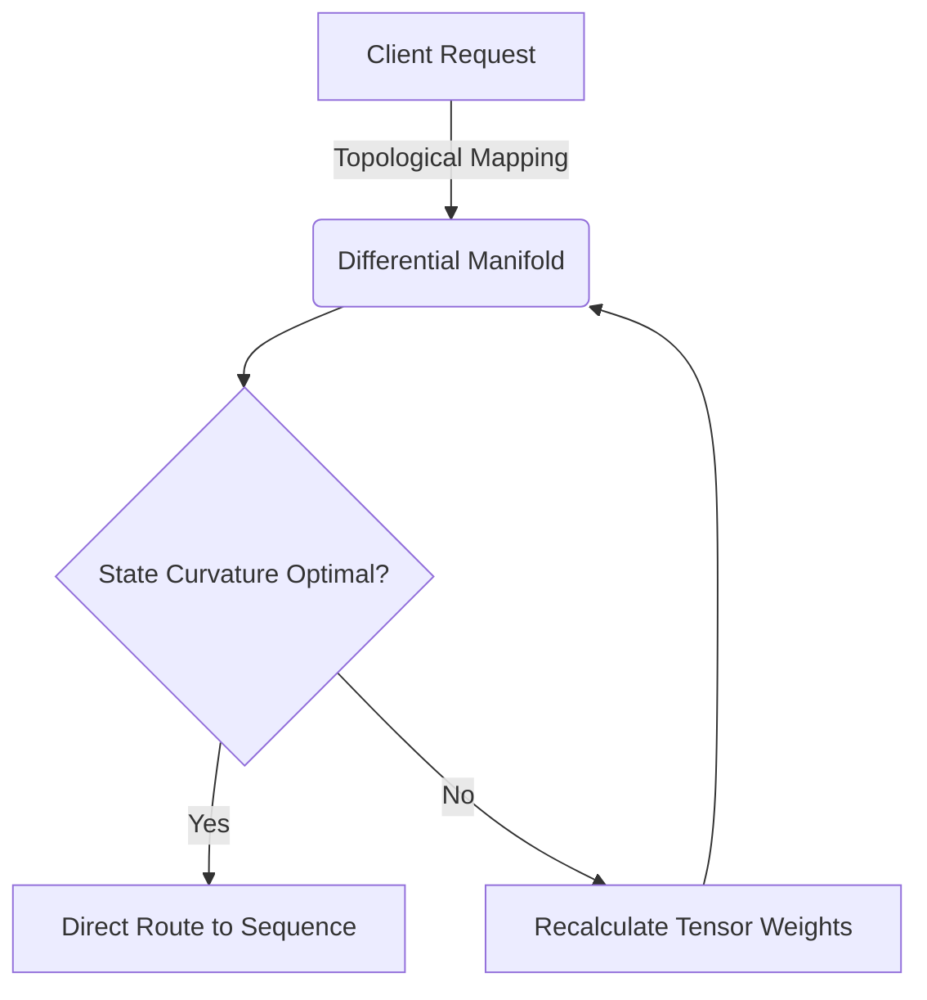
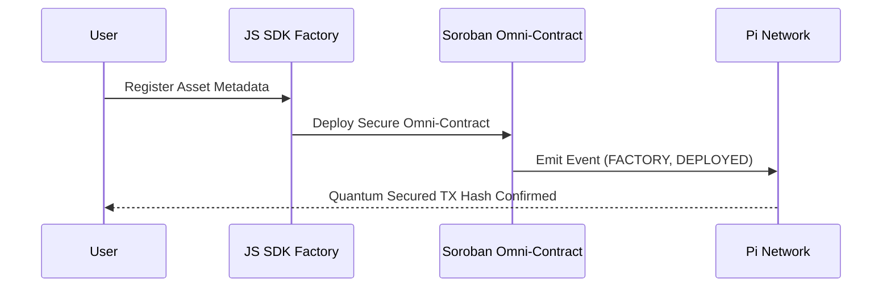
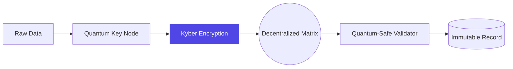
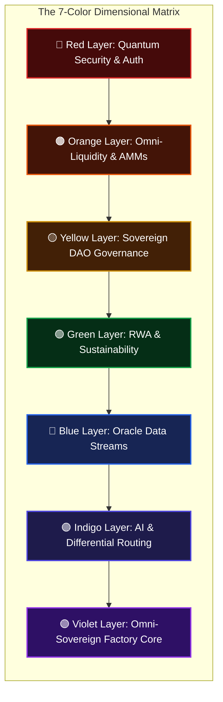
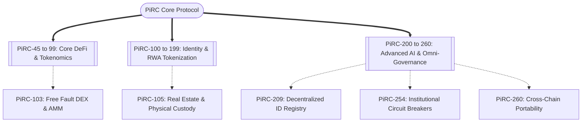
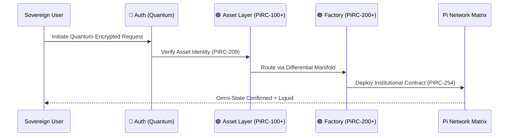
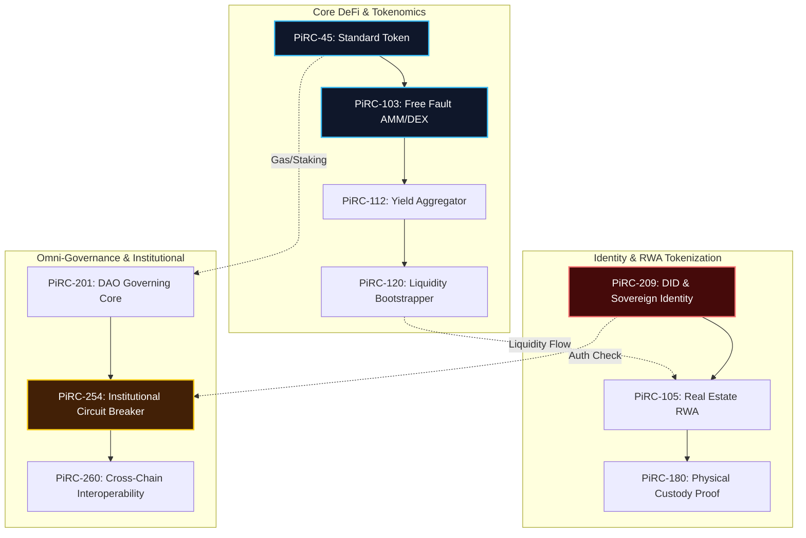
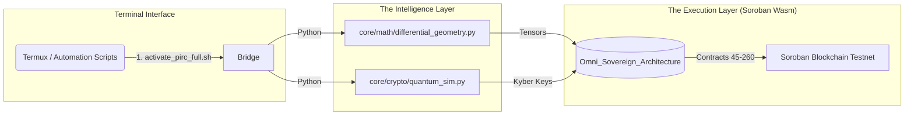
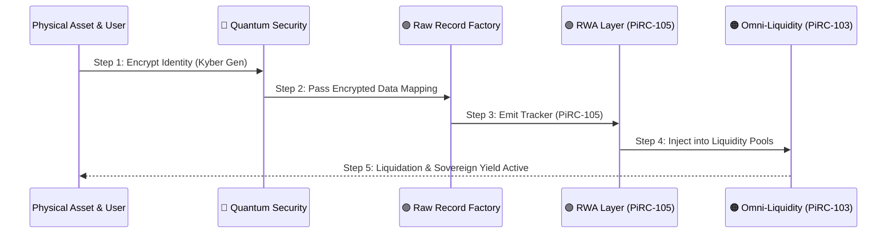

# 🌌 PiRC: Omni Sovereign Automation & Smart Contract Factory

Welcome to **PiRC Omni Sovereign Architecture**. This repository fuses **Differential Engineering** with **Post-Quantum Encryption** to provide an autonomous, secure, and liquid ecosystem for decentralized operations.

---

## 🚀 The "Raw Record Factory" & Ecosystem Impact
The **Sovereign Smart Contract Factory** revolutionizes the digitization of real-world assets:
*   **Total Liquidity:** Transforms physical and digital goods into trackable, sovereign smart contracts.
*   **Differential Routing:** Advanced mathematical manifolds dynamically optimize transaction topological states, killing network friction.
*   **Quantum Security:** Encapsulates payloads with Kyber-compatible encryption, fortifying the ecosystem against future quantum brute-force decryption.

---

## 📂 Core Architecture & Updates Manifest
For our incredible development team, track and explore these core files:

*   `Omni_Sovereign_Architecture/.../raw_record_factory.rs`: Global Soroban Rust Contract.
*   `Omni_Sovereign_Architecture/.../raw_record_factory_sdk.js`: Quantum-tunneled Client SDK.
*   `core/math/differential_geometry.py`: Manifold engine for curvature calculation.
*   `core/crypto/quantum_sim.py`: Quantum key generation layer.

---

## 🛠️ Testing & Integration (Developer Guide)
1. **Smart Contracts:** Install Rust 2024 & Soroban SDK v22. Run `cargo build --target wasm32-unknown-unknown` inside the contract directory.
2. **Quantum/Math Modules:** Requires Python 3. Run `python3 init_models.py` to compute differential vectors and test pseudo-quantum entanglement keys locally.

---

## 🖼️ Architectural Blueprint (Operational Mechanisms)
*Disclaimer: The following professional architecture diagrams are rendered natively in real-time via Mermaid.js.*

### 1. Omni Sovereign Routing (Differential Core)

### 2. Raw Record Factory (Asset to Smart Contract)

### 3. Post-Quantum Security Encapsulation

---

## 🌈 The 7-Colored Dimensional Topology
PiRC operates across a multi-dimensional architecture. The **7 Colored Layers** seamlessly integrate AI, Real-World Assets (RWA), DeFi, and Governance into a single Sovereign matrix.

### Colored Layer Ecosystem Map

---

## 📚 The 150+ Sovereign Standards (PiRC-45 to PiRC-260)
The repository contains a formidable arsenal of over 150+ heavily formalized smart contracts (Rust/Soroban). These standards guarantee strict interoperability and sovereign execution across all dimensions.

### Standards Integration Matrix

---

## 🪐 Comprehensive Unified Workflow (The Omni-State)
Below is the ultimate visualization of how the 7 colored layers and the 150+ PiRC standards operate autonomously under the protection of Quantum Encryption.

---

## 🏛️ Phase 4 Ecosystem Visualizations: The 150+ PiRC Contract Matrix
Below are 3 highly professional, auto-generated diagrams encompassing the exhaustive capabilities of the massive PiRC smart contract monorepo.

### Image 1: The Massive PiRC Omni-Contract Network
This visual maps the precise interactions between the core PiRC standards.

### Image 2: Deep System Architecture (Monorepo Layout)
A structural representation of how the Python AI wrappers connect to the Soroban Rust Smart Contracts.

### Image 3: The 7-Layer Activation Sequence
How a single RWA asset is digitized through all 7 dimensions autonomously.

