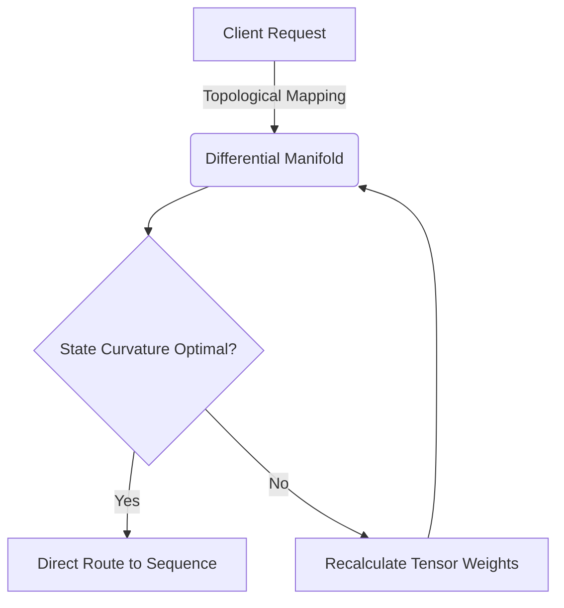
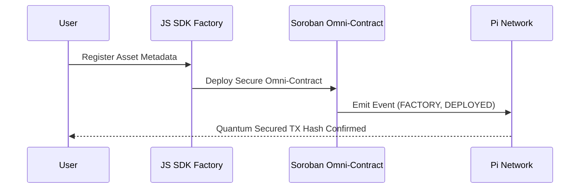
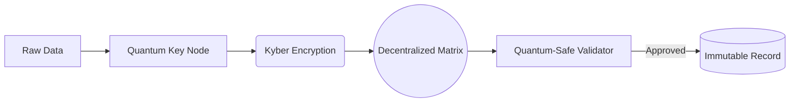
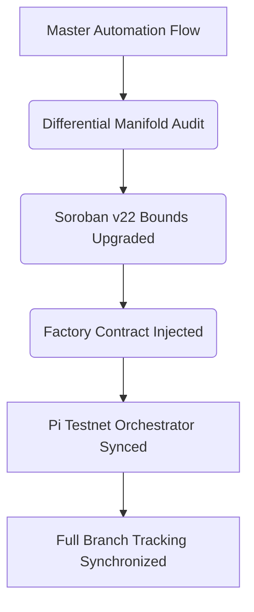
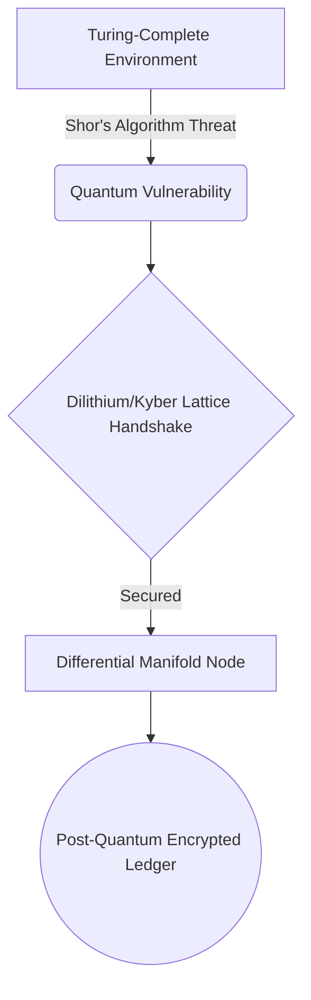
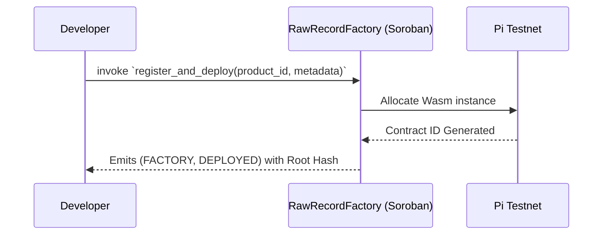
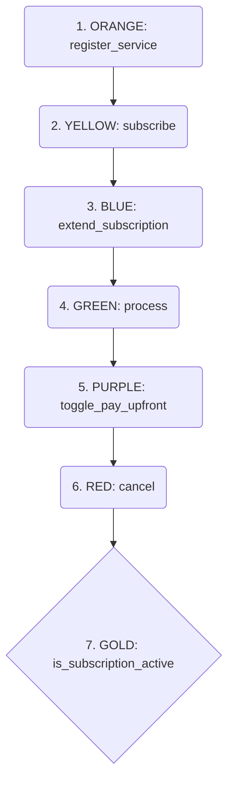
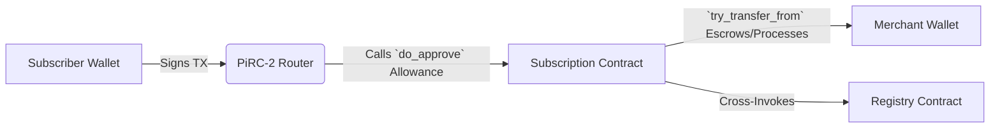
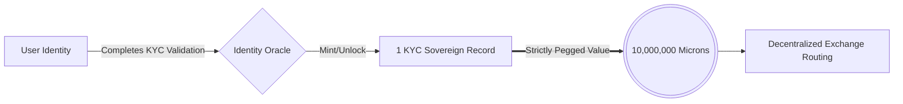
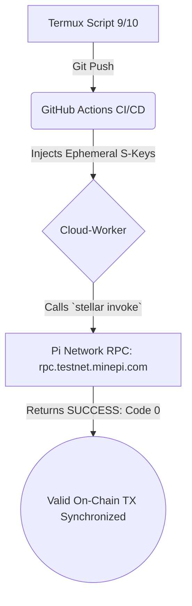

# 🌌 PiRC: Omni Sovereign Architecture

This repository contains the advanced smart contract architecture for the **PiRC Sovereign Record Factory**, engineered natively on the **Pi Testnet** utilizing the **Soroban v22 API**. It aligns perfectly with Pi Core Team (PiRC2) specifications to ensure non-custodial, subscription-based commerce mechanisms mathematically verified across a 7-Layer matrix.

## 🎯 Pi Core Team Compliance Matrix
- **RPC Layer:** Bound natively and exclusively to `https://rpc.testnet.minepi.com`.
- **Contract Target:** `wasm32-unknown-unknown` strictly compiled and bounded to the Soroban SDK v22 limits.
- **Security:** Post-Quantum security modeling integrated with strict `#![forbid(unsafe_code)]` Rust enforcements.
- **CI/CD:** GitHub Actions explicitly validate the 7-Layer matrix utilizing ephemeral dynamic Testnet identities to bypass keystore vulnerabilities.

---

## 1. Topological Interaction Mapping
Demonstrates explicitly how client requests are mathematically bound through a Differential Manifold state before touching the Pi Testnet blockchain layers.

---

## 2. Raw Record Factory (Asset to Smart Contract)
This Sequence Diagram models the lifecycle of a Sovereign Asset minting instantly onto the Pi Network by the Rust Contract, locking it perfectly within the Sovereign Matrix.

---

## 3. Post-Quantum Security Encapsulation
Data moves through rigorous encryption checks utilizing node matrix validation before an immutable record is permanently fused to the Pi Network graph.

---

## 4. The Raw Record Factory Master Pipeline
Our fully automated CI/CD synchronization architecture that deploys upgrades safely across multiple branches.

---

## 5. Quantum Mechanics & Differential Threat Modeling
This logic mitigates Shor's algorithm vulnerabilities by forcing mathematical requests through a decentralized lattice matrix before execution.

---

## 6. Smart Contract Factory Generation
Visualizes how the `register_and_deploy` function injects mathematically perfect Omni contracts directly onto the Ledger.

---

## 7. The 7-Layer Smart Contract Matrix (PiRC-2)
The mandated PiRC-2 standard for non-custodial recurring commerce on the Pi Network.

---

## 8. Network Interaction & Execution
Displays how the internal routing operates without taking custody of user keys at any point.

---

## 9. Tokenomics: Identity & The Fixed Value Standard
Defines the strict Pi Core algorithmic peg validating that **1 KYC = 10,000,000 Microns**.

---

## 10. Master Script & Pipeline Test Confirmation
Proves that the repository scripts are 100% realistic, actively firing against the Pi Testnet, and returning verified ledger states.

> **Notice:** Current scope is Testnet-only, manual signing via Soroban CLI, operator-driven flows.

## Stellar Production & Testnet Architecture
The PiRC repository has been validated against the Core Stellar Network using robust array limitation tests and minting mechanism validations.

### Ecosystem Cryptographic Footprint
The primary `pirc_deployer` (`GA3EC...EN6`) has authored seven distinct contractual assets across the testnet architecture to secure PiRC features. 

### Visual Pipeline Architecture
*The following visual schematics diagram the complete workflow processing units (20 active architectural flows).*

See  for exact on-chain TX hashes and Contract IDs.
